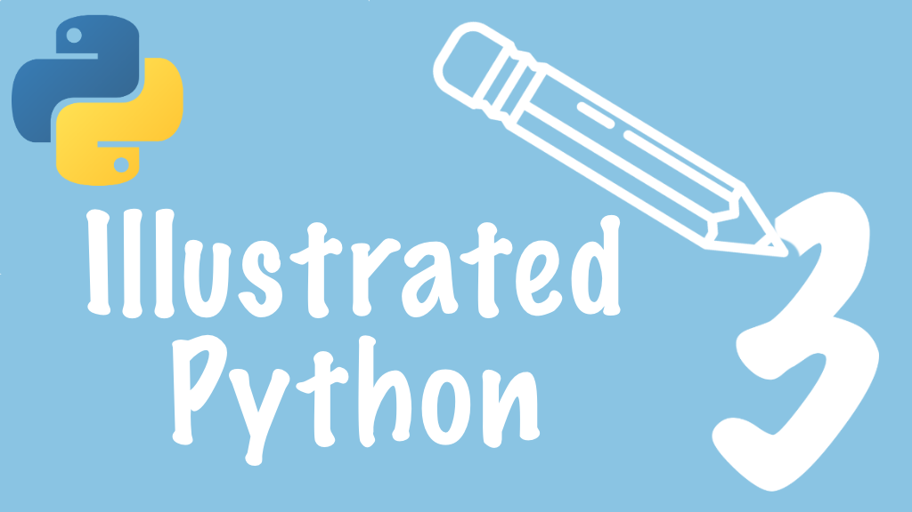

# Python 3, an Illustrated Tour

Course materials and handouts for the [Python 3, an Illustrated Tour course](https://training.talkpython.fm/courses/explore_python3/python-3-illustrated-tour).

## Course Summary

Python 3 has been out for a while and is the best Python version to start any new project. As Python 2 will be end-of-lifed soon, it is also worth looking into porting Python 2 projects to Python 3. Not only is Python 3 faster than previous versions, it is also easier to use now that features like Unicode strings are standard.

If you haven't had the chance to program in Python 3, this course is for you. We will cover the updates and new features found in Python 3. You will see examples of using the latest and greatest, and then try your hand going through the labs trying out these new features.

Once you are done with this course you will pine for using these features in your code.

## What's this course about and how is it different?

This course will teach you to be extremely proficient with Python 3.

We assume you have a base knowledge of the subset of Python that runs in Python 2 and 3. **We dive deep into every aspect of Python 3 and the PEP's that prompted those changes**. From string formatting, f-strings and Unicode to number updates, to changes in classes and functions, this course covers it all. You will see the features in action and try them out for yourself.

In this course, you will:

* Learn how to use f-strings
* Dive into Unicode and discover the gotchas that you can easily prevent
* Create keyword only arguments for greater readability
* How to annotate your code for better collaboration and error checking
* Write your own async functions
* Master virtual environments, pip, and pipenv
* Learn about new modules in the standard library
* Learn how to annotate your code for better collaboration and error checking
* See how the async code works
* Discover extended unpacking
* And lots more

View the full [course outline](https://training.talkpython.fm/courses/explore_python3/python-3-illustrated-tour#course_outline).

## Who is this course for?

For anyone who has wanted to dive into the new features of Python 3. It is quite easy to write code that works in both Python 2 and 3. Many old Python developers are used to the features of 2 and have never looked into all of the new features that Python 3 provides. Many new programmers are using Python 3, but are missing out on new features like async and annotations.

Existing Python 3 users: If you aren't using Python to its full potential, you owe it to yourself to checkout this course and see a wealth of Python 3 features that you might not even know exist. You will see and explore most of them in this course!

## Is this course based on Python 3 or Python 2?

Really? This course is based on Python 3. With Python 2 going unsupported in 2020, we believe that it would be ill-advised to teach or learn Python 2. Most of the material in this course will NOT work in Python 2!

## The time to act is now

Take advantage of Python 3 and all the features and goodies it provides. Your code will be faster, cleaner, and easier for others to read as well. [Take the course at talkpython.fm](https://training.talkpython.fm/courses/explore_python3/python-3-illustrated-tour).

